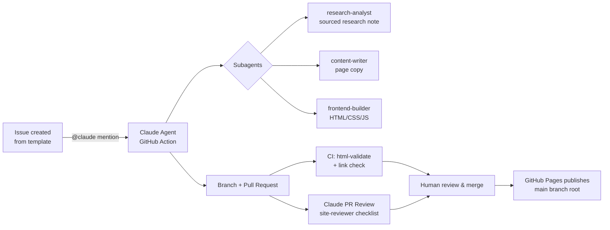

# Agent-Based Development Workflow

This repository is developed with a fully agentic workflow built on
[Claude Code](https://claude.com/claude-code) and the
[Claude Code GitHub Action](https://github.com/anthropics/claude-code-action).
Humans define *what* should happen (issues, reviews, merges); agents do the
research, writing, building, and first-pass reviewing.

## The loop



## 1. Work intake — GitHub Issues

All work starts as an issue using one of the templates:

| Template | Purpose | Primary subagent |
|---|---|---|
| **Research task** | Investigate an AdCP/AAMP development | `research-analyst` |
| **Content update** | Add/change facts, comparisons, tools | `content-writer` |
| **Site feature** | Pages, layout, nav, styling, JS | `frontend-builder` |
| **Bug report** | Broken, wrong, or outdated content | whichever fits |

Mentioning **`@claude`** in the issue body or any comment triggers
`.github/workflows/claude.yml`. The agent reads `CLAUDE.md` for project
conventions, delegates to the subagents in `.claude/agents/`, works on a
branch, and opens a PR referencing the issue.

## 2. Specialized subagents

Defined in `.claude/agents/`, available both locally (Claude Code CLI) and in
the GitHub Action:

- **`research-analyst`** — web research on AdCP/AAMP; outputs sourced research
  notes in `docs/research/`. Never writes HTML. Every claim gets a source URL,
  a status (shipped/announced/speculative), and a verification date.
- **`web-search-researcher`** — deep multi-source web research utility
  (fan-out searches, fetch, cited synthesis). The raw-research layer beneath
  `research-analyst`: it returns findings to its caller and writes no files.
- **`content-writer`** — turns research notes into neutral page copy inside
  the existing HTML structure. Never invents facts, never restructures layout.
- **`frontend-builder`** — owns HTML structure, CSS, JS. Plain static site,
  no build step. Keeps the duplicated nav in sync across all pages and runs
  `html-validate` after changes.
- **`site-reviewer`** — read-only review checklist: sourcing, badge discipline,
  neutrality, design-guide compliance, cross-page consistency, link integrity,
  accessibility, valid HTML.

All three of the writing/building agents work against **[`DESIGN.md`](DESIGN.md)**,
the binding design guide: visual direction, the banned "AI slop" patterns, the
four-state status-badge system, the inline-SVG imagery grammar, the component
inventory, and the accessibility floor. Read it before any visual or markup change.

The separation enforces the content pipeline: **facts are researched before
they are written, and written before they are styled** — and each stage is
independently reviewable.

## 3. Quality gates

Every PR runs:

1. **CI** (`ci.yml`) — `html-validate` on all pages + `lychee` offline link
   check (internal links and fragments must resolve).
2. **Claude PR Review** (`claude-review.yml`) — automatic agentic review of PRs
   touching the site pages, `assets/`, or `docs/`, posted as a review comment.
   It reviews against both the `site-reviewer` checklist and
   [`DESIGN.md`](DESIGN.md), in priority order: sourcing (link + "last
   verified" date on every claim), badge discipline including a badge-inflation
   check, neutrality, nav and footer parity — the footer must keep the AI
   transparency notice and the copyright line — design-guide compliance
   (no banned "AI slop" patterns, inline-SVG imagery, reused components, no
   hardcoded colors), and accessibility and link integrity.
   The job needs the `ANTHROPIC_API_KEY` secret; without it, it emits a setup
   notice and passes rather than failing the PR, so forks stay green.
3. **Human review** — a human merges. Agents never merge to `main`.

## 4. Deployment

GitHub Pages publishes the **`main` branch root** directly (branch
deployment). No build step and no deploy workflow — every merge to `main`
goes live as-is. `.nojekyll` at the root disables Jekyll processing.

## 5. The refresh cycle — keeping content current

Everything above describes how a *change* gets made. This section describes how
the site stays true when nobody asks it to.

The site's product is calibrated confidence about a fast-moving topic: every
claim carries a source and a "last verified" date. That makes staleness
invisible — a page verified eight months ago looks exactly as authoritative as
one verified yesterday. Two scheduled workflows close that gap.

### Monthly: `research-refresh.yml`

Runs at 06:00 UTC on the 1st, and on demand via **Actions → Research Refresh →
Run workflow** (which takes an optional `focus` topic). It:

1. Re-verifies the claims currently on the site against their cited sources.
2. Searches for developments since the last verification date.
3. Tries to close the open questions carried in
   [`research/README.md`](research/README.md).
4. Writes a **new dated note** in `docs/research/` — notes accumulate, forming
   an evidence trail over time rather than being overwritten.
5. Updates the pages: corrects claims, adjusts badges where evidence strength
   changed, adds new developments to the home page changelog, and refreshes the
   `page-meta` date **only on pages it actually re-verified**.
6. Opens a pull request. It never merges — a human reviews, exactly as with any
   other change.

The rule the prompt enforces hardest: **never bump a "last verified" date for a
claim that was not re-checked.** A date that launders an unverified claim is
worse than a stale one. A refresh that confirms nothing changed is a successful
refresh, and should say so rather than manufacturing edits.

### Weekly: `freshness-check.yml`

The refresh can fail quietly — an expired API key, an error, a pull request
nobody merges. This job runs every Monday, finds the newest `last verified` date
across the pages, and if it is more than **45 days** old (one missed cycle plus
review time) opens or updates a `freshness`-labeled issue. It also fails loudly
if it can find no verification dates at all, which would mean the citation
format broke.

Both jobs skip with a setup notice when `ANTHROPIC_API_KEY` is absent, so a fork
never fails on them.

## One-time repository setup (human, once)

1. **Secret**: Settings → Secrets and variables → Actions → add
   `ANTHROPIC_API_KEY` (used by `claude.yml`, `claude-review.yml`, and
   `research-refresh.yml`).
   Alternatively run `/install-github-app` from the Claude Code CLI, which
   configures the app and secret for you.
2. **Pages**: Settings → Pages → Build and deployment → Source:
   **Deploy from a branch**, Branch: **main**, Folder: **/ (root)**.
3. **Branch protection** (recommended): protect `main`, require the CI checks
   and one human review before merge.
4. **Labels**: the issue templates use `research`, `content`, `site`, `bug`,
   `agent-task` — create them once (or let the first issues create them).

## Working locally

The same workflow runs locally with the Claude Code CLI:

```bash
cd AgenticBuying
claude                       # picks up CLAUDE.md + .claude/agents/ automatically
# e.g.: "Use research-analyst to check what changed in AdCP this month,
#        then update comparison.html accordingly."
```

Serve and validate:

```bash
python3 -m http.server 8000
npx --yes html-validate "*.html"
```

## Conventions

- Branches: `claude/<topic>` (agent), `feat|fix/<topic>` (human).
- Every factual site claim: source link + "last verified" date + status badge.
- Research notes live in `docs/research/<topic>-<yyyy-mm-dd>.md` and are the
  canonical evidence trail behind the site's content.
