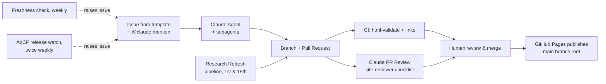
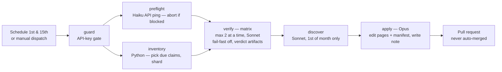

# Agent-Based Development Workflow

This repository is developed with a fully agentic workflow built on
[Claude Code](https://claude.com/claude-code) and the
[Claude Code GitHub Action](https://github.com/anthropics/claude-code-action).
Humans define *what* should happen (issues, reviews, merges); agents do the
research, writing, building, and first-pass reviewing.

## The loop

Changes reach the site two ways — a human opening an issue, or the scheduled
research refresh — but both converge on the same review-and-merge gate, and no
agent ever merges to `main`.



The subagents behind the Claude Agent (research, writing, building, reviewing)
are described in §2; the research-refresh pipeline is detailed in §5.

## 1. Work intake — GitHub Issues

All work starts as an issue using one of the templates:

| Template | Purpose | Primary subagent |
|---|---|---|
| **Research task** | Investigate an AdCP/AAMP development | `research-analyst` |
| **Content update** | Add/change facts, comparisons, tools | `content-writer` |
| **Site feature** | Pages, layout, nav, styling, JS | `frontend-builder` |
| **Bug report** | Broken, wrong, or outdated content | whichever fits |

Mentioning **`@claude`** in the issue body or any comment triggers
`.github/workflows/claude.yml`. The agent reads `CLAUDE.md` for project
conventions, delegates to the subagents in `.claude/agents/`, works on a
branch, and opens a PR referencing the issue.

## 2. Specialized subagents

Defined in `.claude/agents/`, available both locally (Claude Code CLI) and in
the GitHub Action:

- **`research-analyst`** — web research on AdCP/AAMP; outputs sourced research
  notes in `docs/research/`. Never writes HTML. Every claim gets a source URL,
  a status (shipped/announced/reported/speculative), and a verification date.
- **`web-search-researcher`** — deep multi-source web research utility
  (fan-out searches, fetch, cited synthesis). The raw-research layer beneath
  `research-analyst`: it returns findings to its caller and writes no files.
- **`content-writer`** — turns research notes into neutral page copy inside
  the existing HTML structure. Never invents facts, never restructures layout.
- **`frontend-builder`** — owns HTML structure, CSS, JS. Plain static site,
  no build step. Keeps the duplicated nav in sync across all pages and runs
  `html-validate` after changes.
- **`site-reviewer`** — read-only review checklist: sourcing, badge discipline,
  neutrality, design-guide compliance, cross-page consistency, link integrity,
  accessibility, valid HTML.

All three of the writing/building agents work against **[`DESIGN.md`](DESIGN.md)**,
the binding design guide: visual direction, the banned "AI slop" patterns, the
four-state status-badge system, the inline-SVG imagery grammar, the component
inventory, and the accessibility floor. Read it before any visual or markup change.

The separation enforces the content pipeline: **facts are researched before
they are written, and written before they are styled** — and each stage is
independently reviewable.

Model tiers: every subagent except `content-writer` pins `model: sonnet` in its
frontmatter. Searching, building static HTML, and checking a change against a
written checklist are all mechanical enough for Sonnet, and subagents otherwise
inherit the caller's model — so an Opus-driven session was spawning Opus
subagents for all of it. `content-writer` stays on the inherited (Opus) tier:
neutral tone and badge discipline are judgement calls that ship to the live
site. The same split runs in CI — see the cost note under the research refresh.

## 3. Quality gates

Every PR runs:

1. **CI** (`ci.yml`) — `html-validate` on all pages + `lychee` offline link
   check (internal links and fragments must resolve).
2. **Claude PR Review** (`claude-review.yml`) — automatic agentic review of PRs
   touching the site pages, `assets/`, or `docs/`, posted as a review comment.
   It runs when a PR **opens or leaves draft**, not on every push: a review is a
   full agent run, and re-reviewing an unchanged checklist after each push was
   the repo's single largest token line. To re-review after pushing fixes,
   comment `@claude` on the PR.
   **A PR that edits a workflow file gets no agentic review.** The action
   validates that its own workflow matches the copy on the default branch and
   skips itself when it does not — a platform guardrail against a PR granting
   itself new agent permissions. The job still reports success; the log says
   `Workflow validation failed … your workflow will begin working once you merge
   your PR`. Review those PRs by hand, and expect the first run after merge to be
   the real test of any workflow change.
   It reviews against both the `site-reviewer` checklist and
   [`DESIGN.md`](DESIGN.md), in priority order: sourcing (link + "last
   verified" date on every claim), badge discipline including a badge-inflation
   check, neutrality, nav and footer parity — the footer must keep the AI
   transparency notice and the copyright line — design-guide compliance
   (no banned "AI slop" patterns, inline-SVG imagery, reused components, no
   hardcoded colors), and accessibility and link integrity.
   The job needs the `ANTHROPIC_API_KEY` secret; without it, it emits a setup
   notice and passes rather than failing the PR, so forks stay green.
3. **Human review** — a human merges. Agents never merge to `main`.

## 4. Deployment

GitHub Pages publishes the **`main` branch root** directly (branch
deployment). No build step and no deploy workflow — every merge to `main`
goes live as-is. `.nojekyll` at the root disables Jekyll processing.

## 5. The refresh cycle — keeping content current

Everything above describes how a *change* gets made. This section describes how
the site stays true when nobody asks it to.

The site's product is calibrated confidence about a fast-moving topic: every
claim carries a source and a "last verified" date. That makes staleness
invisible — a page verified eight months ago looks exactly as authoritative as
one verified yesterday. Three scheduled workflows close that gap.

### Twice monthly: `research-refresh.yml`

Runs at 06:00 UTC on the **1st and 15th**, and on demand via **Actions → Research
Refresh → Run workflow** (which takes a `scope` — `due` or `all` — an optional
`focus` topic, and a `debug` toggle that unhides the agents' full output when a
stage needs diagnosing). It is a **pipeline of jobs**, not one agent, so a slow
run can no longer lose all its work:



0. **preflight** (deterministic, one cheap Haiku call to the Anthropic API)
   confirms the key works and the account isn't rate/spend-limited *before* any
   agents fan out. Because the Claude Code action hides its output, a blocked
   account otherwise fails opaquely across every agent; the preflight surfaces
   the real HTTP status and error type in one place, opens a `refresh-blocked`
   issue, and skips the rest of the pipeline. Verify, discover, and apply all
   require it to pass.
1. **inventory** (plain Python, no LLM) reads the claim manifest
   [`research/claims.yaml`](research/claims.yaml), selects the claims that are
   **due** this cycle, and splits them into shards. Due = everything tagged
   `volatility: high` every run, plus slower-moving claims once they age past a
   threshold; `scope: all` forces a full sweep.
2. **verify** fans the shards out across jobs (`fail-fast: false`, a short
   per-shard timeout, at most two at a time). Each job re-checks its handful of
   claims against their cited sources and writes a durable **verdict artifact** —
   so one unreachable source, or one slow shard, can't sink the rest.
3. **discover** searches for developments since the last cycle and tries to close
   the open questions in [`research/README.md`](research/README.md). It runs
   *after* verify (see the concurrency note below) and only on the **1st of the
   month** (and on manual dispatch) — the 15th run verifies but does not discover.
4. **apply** turns the verdicts + discoveries into the actual change: it updates
   `claims.yaml`, corrects claims and adjusts badges on the pages, adds new
   developments to the home-page changelog, refreshes each `page-meta` date
   **only where a claim on that page was actually re-verified**, writes a **new
   dated note** in `docs/research/` (notes accumulate — an evidence trail, never
   overwritten), and opens a pull request with a summary table. It never merges;
   a human reviews, exactly as with any other change.

Why the split: re-verification is a *bounded* list of known URLs; discovery is an
*unbounded* web search. The old single-job design let the unbounded half starve
the bounded half — the half the "last verified" dates depend on — and a timeout
lost everything. Sharding plus per-shard artifacts make progress durable, and the
manifest keeps each run's work bounded instead of scaling with the whole site.

Stage contracts: each agent stage's output artifact is its contract with the next
one, so **a stage that produces nothing fails at itself** rather than passing the
gap downstream — every upload is `if-no-files-found: error`. `apply` is the other
half of that rule: it degrades instead of dying, taking whatever verdicts landed,
skipping discoveries when `discover` is red, and still opening a PR, and it logs
one notice naming exactly which inputs reached it. The 2026-09-01 run is why both
halves exist — the discovery agent returned success without writing its file, a
`warn` upload kept the job green, and `apply` then hard-failed on the missing
artifact, discarding five successful verify shards. Durable artifacts only make
progress durable if a missing one is loud.

`apply` was the residual gap, and now checkpoints. Every other stage's output is
durable the moment it uploads its artifact, but apply used to hold the dated note,
the manifest edits and the pull request in one uncommitted working tree until the
very end — so a timeout discarded the whole run's verification, which is the
"a run that timed out produced nothing" failure the pipeline was built to remove,
surviving in its last un-sharded stage. Run 10, a full `scope: all` sweep of 63
claims, came within ninety seconds of exactly that.

Three things close it. Apply **creates and pushes its branch before editing
anything**, and pushes again after each phase — the manifest first, then the page
edits, then the note, in that order, so the cheapest output to reproduce and the
one the site's freshness dates depend on lands first. Its **agent step is
time-boxed 35 minutes against the job's 40**, so running out of time fails that
step rather than cancelling the job, because a cancelled job is not a reliable
place to do work. And a **salvage step** then pushes whatever was committed and
opens a draft pull request titled PARTIAL, naming which phases to expect and how
many files were uncommitted and therefore lost. A timeout now costs a run its
completeness, not its work.

Concurrency and cost: verify runs at most **two shards at once** and discover runs
**after** them, so the pipeline never has more than two Claude Code agents on the
API together — the first `scope: all` run set this higher and tripped the account's
rate limit. To keep token spend down, **verify and discover run on Sonnet** (fetch
and check, and search and summarize, don't need Opus), while **apply stays on Opus**
because it rewrites page prose and badges against the design guide, where a mistake
ships live. Discovery — the priciest, unbounded stage — runs only monthly (the 1st),
and the deterministic AdCP release watch covers new releases in between. The PR
reviewer (`claude-review.yml`) follows the same rule and runs on Sonnet: checking
a diff against two written checklists is the verify stage's shape, not apply's.

The rule the prompts enforce hardest: **never bump a "last verified" date for a
claim that was not re-checked.** A date that launders an unverified claim is
worse than a stale one. A refresh that confirms nothing changed is a successful
refresh, and should say so rather than manufacturing edits.

### On demand: `api-health.yml`

After rotating the `ANTHROPIC_API_KEY` secret, run **Actions → API Health → Run
workflow**. It makes one `max_tokens: 8` Haiku call and reports the HTTP status —
a fraction of a cent, versus the $12-16 a full refresh costs to learn the same
thing. HTTP 200 means the key is valid and the account is not rate or spend
limited; 401, 429 and 400 each get an explanation of what it means for the agents.

It duplicates the refresh's `preflight` probe on purpose — see the comment at the
top of the file. Change both if the probe ever changes.

### Weekly: `freshness-check.yml`

The refresh can fail quietly — an expired API key, an error, a pull request
nobody merges. This job runs every Monday, finds the newest `last verified` date
across the pages, and if it is more than **21 days** old (one missed cycle plus
review time, against a ~15-day cycle) opens or updates a `freshness`-labeled
issue. Keep that threshold in step with the refresh cron: a limit looser than
two cycles stops catching anything. It also fails loudly
if it can find no verification dates at all, which would mean the citation
format broke.

### Twice weekly: `adcp-release-watch.yml`

A cheap, **deterministic** fast lane on the single most volatile fact the site
tracks — the latest AdCP release. AdCP ships weekly-plus, but the full refresh
runs only fortnightly, so the headline version can fall behind between cycles.
This job (Mondays and Thursdays) hits the AdCP releases API directly, compares
the newest release *by semver* to the version the claim manifest records, and
opens or updates a `release-watch` issue when a newer one exists. It involves no
model — a direct API comparison, so no cost and nothing to hallucinate — and it
only flags the gap: it points a human (or a focused refresh run) at the new
release, it does not edit pages or open PRs.

The refresh and freshness jobs skip with a setup notice when `ANTHROPIC_API_KEY`
is absent, so a fork never fails on them. The release watch needs no key — it
reads a public API — and runs regardless.

## 6. Cost control

Every agent run's cost is recorded automatically. The report lives in
**[`COST-CONTROL.md`](COST-CONTROL.md)** and is regenerated after each run —
it is a generated view, never hand-edited, and CI fails if it drifts from the
ledger.

How the capture works:

1. Each `anthropics/claude-code-action` step carries `id: agent`, and is
   followed by a `Record cost` step (`.github/actions/record-cost`) running
   `if: always()`. That step reads the action's `execution_file` output — a JSON
   event log whose final `"type": "result"` event carries `total_cost_usd`,
   `usage`, `num_turns` and `duration_ms` — and uploads one `cost-<stage>` artifact.
2. At the end of the run, a `ledger` job calls the reusable
   [`cost-ledger.yml`](../.github/workflows/cost-ledger.yml), which collects
   every `cost-*` artifact from that run, appends them to
   `docs/cost/ledger.jsonl`, regenerates the report, and commits both to `main`.

Two deliberate exceptions to the repo's usual rules, both worth knowing:

- **The ledger job commits to `main` directly**, where everything else opens a
  PR. It is not an agent — it is a Python script over JSON, with no model in the
  loop — and a ledger gated behind human review would always lag the runs it
  describes. It writes only under `docs/cost/` and to `docs/COST-CONTROL.md`.
- **`if: always()` on the capture step** means failed runs are recorded too. A
  run the API rejected spent nothing, and that is exactly the case where a silent
  gap in the ledger would read as a cheap month. Such runs land with
  `parse_status` set and are counted in the report's *Unmeasured* column.

What it cannot tell you: **cost is per agent invocation, not per subagent.**
When `apply` spawns `site-reviewer`, that subagent's tokens roll into `apply`'s
total. The per-model breakdown is the only subagent signal — a stage configured
for Opus that shows Sonnet spend is showing its subagents. And `total_cost_usd`
is priced at public list rates, so it is an upper bound on the invoice, not the
invoice; the Anthropic Console remains the billing source of truth.

### Backfill

Runs from before the capture existed are still recoverable. The action prints
its result block to the job log, and GitHub keeps Actions logs for **90 days**,
so `scripts/backfill_cost.py` reconstructs those rows from the logs:

```bash
python3 scripts/backfill_cost.py --dry-run   # show what would be added
python3 scripts/backfill_cost.py             # append to the ledger
python3 scripts/cost_report.py               # regenerate the report
```

It is a local one-off, not part of any workflow, and it skips runs already in
the ledger — so re-running it is safe. Backfilled rows are stamped
`source: "log-backfill"`. **They carry no token counts and no per-model
breakdown**: the logged result block is a reduced form with only cost, turns,
duration and the run's model. The costs themselves are real.

The 90-day retention is the catch — logs older than that are gone for good, so
this is not a substitute for the live capture.

To regenerate locally after pulling:

```bash
python3 scripts/cost_report.py          # rewrite the report from the ledger
python3 scripts/cost_report.py --check  # what CI runs
```

## One-time repository setup (human, once)

1. **Secret**: Settings → Secrets and variables → Actions → add
   `ANTHROPIC_API_KEY` (used by `claude.yml`, `claude-review.yml`, and
   `research-refresh.yml`).
   Alternatively run `/install-github-app` from the Claude Code CLI, which
   configures the app and secret for you.
2. **Pages**: Settings → Pages → Build and deployment → Source:
   **Deploy from a branch**, Branch: **main**, Folder: **/ (root)**.
3. **Branch protection** (recommended): protect `main`, require the CI checks
   and one human review before merge.
4. **Labels**: the issue templates use `research`, `content`, `site`, `bug`,
   `agent-task` — create them once (or let the first issues create them).

## Working locally

The same workflow runs locally with the Claude Code CLI:

```bash
cd AgenticBuying
claude                       # picks up CLAUDE.md + .claude/agents/ automatically
# e.g.: "Use research-analyst to check what changed in AdCP this month,
#        then update comparison.html accordingly."
```

Serve and validate:

```bash
python3 -m http.server 8000
npx --yes html-validate "*.html"
```

## Conventions

- Branches: `claude/<topic>` (agent), `feat|fix/<topic>` (human).
- Every factual site claim: source link + "last verified" date + status badge.
- Research notes live in `docs/research/<topic>-<yyyy-mm-dd>.md` and are the
  canonical evidence trail behind the site's content.
