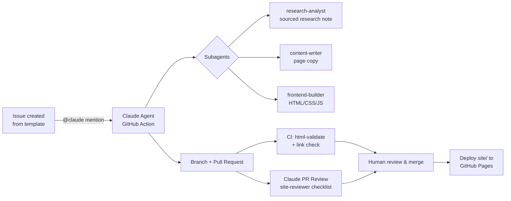

# Agent-Based Development Workflow

This repository is developed with a fully agentic workflow built on
[Claude Code](https://claude.com/claude-code) and the
[Claude Code GitHub Action](https://github.com/anthropics/claude-code-action).
Humans define *what* should happen (issues, reviews, merges); agents do the
research, writing, building, and first-pass reviewing.

## The loop



## 1. Work intake — GitHub Issues

All work starts as an issue using one of the templates:

| Template | Purpose | Primary subagent |
|---|---|---|
| **Research task** | Investigate an AdCP/AAMP development | `research-analyst` |
| **Content update** | Add/change facts, comparisons, tools | `content-writer` |
| **Site feature** | Pages, layout, nav, styling, JS | `frontend-builder` |
| **Bug report** | Broken, wrong, or outdated content | whichever fits |

Mentioning **`@claude`** in the issue body or any comment triggers
`.github/workflows/claude.yml`. The agent reads `CLAUDE.md` for project
conventions, delegates to the subagents in `.claude/agents/`, works on a
branch, and opens a PR referencing the issue.

## 2. Specialized subagents

Defined in `.claude/agents/`, available both locally (Claude Code CLI) and in
the GitHub Action:

- **`research-analyst`** — web research on AdCP/AAMP; outputs sourced research
  notes in `docs/research/`. Never writes HTML. Every claim gets a source URL,
  a status (shipped/announced/speculative), and a verification date.
- **`web-search-researcher`** — deep multi-source web research utility
  (fan-out searches, fetch, cited synthesis). The raw-research layer beneath
  `research-analyst`: it returns findings to its caller and writes no files.
- **`content-writer`** — turns research notes into neutral page copy inside
  the existing HTML structure. Never invents facts, never restructures layout.
- **`frontend-builder`** — owns HTML structure, CSS, JS. Plain static site,
  no build step. Keeps the duplicated nav in sync across all pages and runs
  `html-validate` after changes.
- **`site-reviewer`** — read-only review checklist: sourcing, neutrality,
  cross-page consistency, link integrity, accessibility, valid HTML.

The separation enforces the content pipeline: **facts are researched before
they are written, and written before they are styled** — and each stage is
independently reviewable.

## 3. Quality gates

Every PR runs:

1. **CI** (`ci.yml`) — `html-validate` on all pages + `lychee` offline link
   check (internal links and fragments must resolve).
2. **Claude PR Review** (`claude-review.yml`) — automatic agentic review of
   PRs touching `site/` or `docs/`, following the `site-reviewer` checklist,
   posted as a review comment.
3. **Human review** — a human merges. Agents never merge to `main`.

## 4. Deployment

`deploy-pages.yml` publishes `site/` to **GitHub Pages** on every push to
`main`. No build step — the directory is uploaded as-is.

## One-time repository setup (human, once)

1. **Secret**: Settings → Secrets and variables → Actions → add
   `ANTHROPIC_API_KEY` (used by `claude.yml` and `claude-review.yml`).
   Alternatively run `/install-github-app` from the Claude Code CLI, which
   configures the app and secret for you.
2. **Pages**: Settings → Pages → Build and deployment → Source:
   **GitHub Actions**.
3. **Branch protection** (recommended): protect `main`, require the CI checks
   and one human review before merge.
4. **Labels**: the issue templates use `research`, `content`, `site`, `bug`,
   `agent-task` — create them once (or let the first issues create them).

## Working locally

The same workflow runs locally with the Claude Code CLI:

```bash
cd AgenticBuying
claude                       # picks up CLAUDE.md + .claude/agents/ automatically
# e.g.: "Use research-analyst to check what changed in AdCP this month,
#        then update comparison.html accordingly."
```

Serve and validate:

```bash
python3 -m http.server 8000 --directory site
npx --yes html-validate "site/**/*.html"
```

## Conventions

- Branches: `claude/<topic>` (agent), `feat|fix/<topic>` (human).
- Every factual site claim: source link + "last verified" date + status badge.
- Research notes live in `docs/research/<topic>-<yyyy-mm-dd>.md` and are the
  canonical evidence trail behind the site's content.
